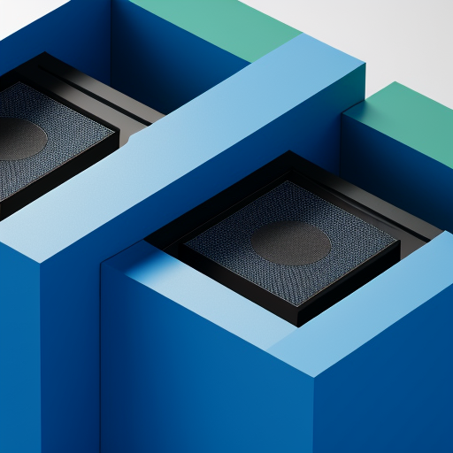

# For things regarding np.dot and perhaps torch.bmm

This repository contains experimental implementations and benchmarks for matrix multiplication and dot products. The code is for educational and research purposes.

⚠️ **Disclaimer**: The implementations in this repository are experimental and may not be optimized for production use. Results may vary across different hardware configurations and should not be considered definitive performance benchmarks.

## Notebooks
My own notebooks for nlp with transformers are included.

